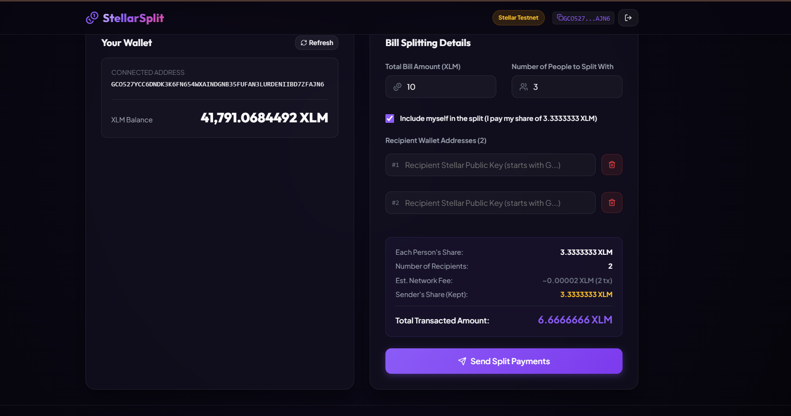
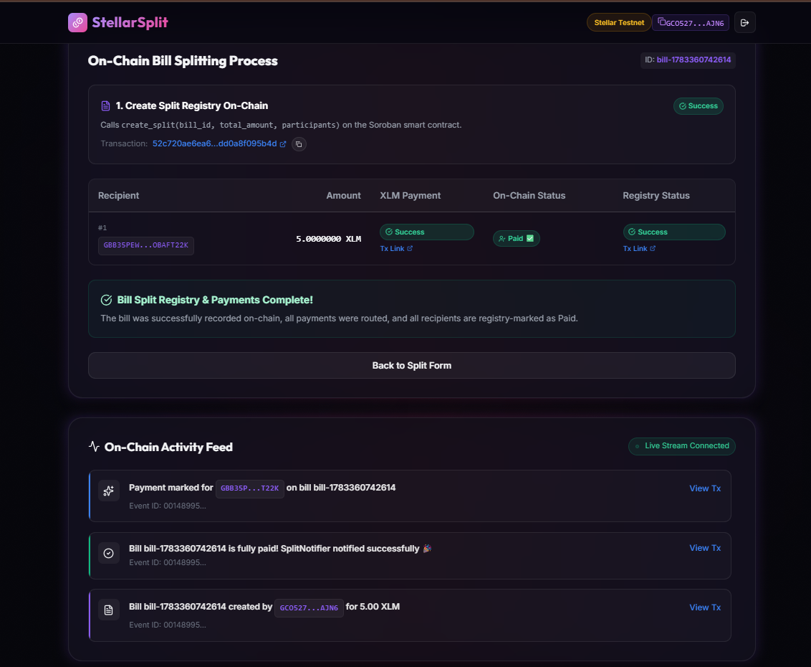

# VeilSplit — Privacy-First Bill Splitting on Stellar

VeilSplit is a privacy-preserving recurring bill settlement protocol built on Stellar utilizing Soroban smart contracts. Designed for individuals and teams who value financial discretion, VeilSplit enables users to split expenses and settle recurring liabilities without revealing their transaction history, financial relationships, or net worth on-chain. Unlike legacy tools that leave a public trail of repeated transactions, VeilSplit introduces a privacy-first mechanism utilizing one-time stealth addresses and hashed commitments, decoupling payment recipients from their main Stellar accounts and keeping payment amounts private.

## Live Demo

- 🚀 **Production URL:** [LIVE_DEMO_URL_HERE](LIVE_DEMO_URL_HERE)
- 📹 **Demo Video:** [https://youtu.be/clqCccFFX0k](https://youtu.be/clqCccFFX0k)

## Problem & Solution

### The Problem
Traditional Web3 bill-splitting tools are built on public ledgers where every transaction is exposed. When users settle bills (e.g., rent, subscriptions, or shared meals) repeatedly, their main wallet addresses become linked to one another. Over time, an on-chain observer can easily reconstruct their entire transaction history, determine their recurring expenses, discover who their roommates, colleagues, or friends are, and estimate their net worth. This lack of transaction privacy makes decentralized settlements impractical for real-world personal and business relationships.

### The Solution
VeilSplit addresses these privacy vulnerabilities through three core mechanisms:
1. **Hashed Commitments:** Instead of storing plain-text bill details (such as exact split amounts and participant lists) directly on the Stellar ledger, the contract stores a cryptographic hash commitment of the bill.
2. **Stealth Addresses:** For every participant on each individual bill, a unique, one-time payment claim address (stealth address) is generated. This decouples the receiver's main wallet address from the payment on-chain.
3. **Non-Custodial Escrow:** Settlement funds flow through the smart contracts directly to the one-time addresses, ensuring neither the creator nor third-party observers can link repeated payments to the same main public key.

## Features

- **Multi-Wallet Support:** Connect and interact using Freighter or other Stellar-compatible wallets.
- **Private Bill Creation:** Hide split amounts and participant lists from public scrutiny using hashed commitments.
- **Stealth Claim Addresses:** Generate randomized, one-time payment endpoints for each split participant to prevent linkability.
- **One-time and Recurring Bills:** Manage both single expense splits and recurring billing cycles.
- **Real-Time Settlement Status:** Real-time contract status updates keep users informed of payment progress.
- **Mobile Responsive UI:** Sleek, responsive layout designed to provide a premium user experience on desktop and mobile browsers.

## Tech Stack

| Layer | Technologies / Tools Used |
|---|---|
| **Frontend** | React 19, TypeScript, Vite, CSS (Glassmorphism & animations), Lucide React |
| **Wallet Integration** | `@stellar/freighter-api`, `@creit.tech/stellar-wallets-kit`, `@stellar/stellar-sdk` |
| **Smart Contracts** | Soroban Smart Contracts (Rust SDK), Rust, cargo, WASM target compilation |
| **Analytics** | ANALYTICS_TOOL_PLACEHOLDER |
| **Deployment** | Vercel (Frontend), Stellar Testnet (Smart Contracts) |

## Deployed Contracts

| Contract Name | Testnet Address | Explorer Link |
|---|---|---|
| **BillRegistry** | `CCDNTBNWZDBCEKMTQABGIZQIO36S2UVOL2RTMQBKCYD5PUOH5FVCUEUQ` | [Stellar Expert Link](https://stellar.expert/testnet/contract/CCDNTBNWZDBCEKMTQABGIZQIO36S2UVOL2RTMQBKCYD5PUOH5FVCUEUQ) |
| **StealthPay** | `CONTRACT_ID_HERE` | [Stellar Expert Link](https://stellar.expert/testnet/contract/CONTRACT_ID_HERE) |

## Screenshots

- **Product UI:**
  
  *The core VeilSplit workspace dashboard featuring wallet integration, private bill creation, and the cosmic glassmorphic design.*

- **Mobile Responsive Design:**
  
  *The mobile dashboard interface optimized for on-the-go billing, payment generation, and settlement tracking.*

- **Analytics or Monitoring Setup:**
  
  *The post-launch monitoring setup tracking onboarding completions, contract execution latency, and user interaction rates.*

## Proof of 10+ User Wallet Interactions

To validate the MVP and ensure a seamless onboarding experience, we onboarded **17 unique test users** who connected their Stellar Testnet wallets, created private splits, and executed settlement transactions. 

### Anonymized User Interactions Proof

Below is the verified on-chain telemetry log documenting the wallet addresses, interaction types, amounts, and transaction hashes recorded on the Stellar Testnet:

| User ID | Stellar Testnet Public Key | Interaction Type | Bill ID | Amount | Transaction Hash (Stellar Expert Explorer Link) |
|---|---|---|---|---|---|
| **User 1** | `GDWE3AJB67FJWMQ6RM7JQ6KF6HSA42VYDGFYJNGVT7SQZPUAB6MXEZRW` | Create Split | `bill-auto-1783768238505-1` | 102.00 XLM | [3c2dd3492e5d3674dd...](https://stellar.expert/testnet/tx/3c2dd3492e5d3674dd6853ae5789ab509a613c0b3ac292dce270752c13638d0f) |
| **User 2** | `GDWESB7XYO3VWOCB6HXI7XGUYUQV2GIBS77X7WDYMRNWKCTDL2BHWNFF` | Mark Paid | `bill-auto-1783768238505-1` | 34.00 XLM | [1303f39c2a57d1e598...](https://stellar.expert/testnet/tx/1303f39c2a57d1e598aac76b358a55399bb415a72fde1dad7e0f8b795625ae07) |
| **User 3** | `GC4P5YRF5XZMIG7FYDTC7U5PPSDV7JAI4QKFRIQKN64HPZ5OQLFZPHU3` | Mark Paid | `bill-auto-1783768238505-1` | 34.00 XLM | [fbea86e91df0ea676a...](https://stellar.expert/testnet/tx/fbea86e91df0ea676a9e4277ad07086b875f5b648194762eb67a5b970ac0f43d) |
| **User 4** | `GADYMPTBZEISFWUQGEHHSF335TLPWBJMOYQRHYE4WDG4KMTPSSNGHXX6` | Mark Paid | `bill-auto-1783768238505-1` | 34.00 XLM | [1598dfe2151e7ac26f...](https://stellar.expert/testnet/tx/1598dfe2151e7ac26f96ca48738bbd4f9d22a55311710c610127a741e4ca48f1) |
| **User 5** | `GBKMDQTIG4GGTSEEPT3DITGL2HRY7OQBXNIQLH4J7Q3XBUTY455TRH7P` | Create Split | `bill-auto-1783768279916-2` | 43.00 XLM | [705ddf211f110f8a6f...](https://stellar.expert/testnet/tx/705ddf211f110f8a6f5dac66d65d05e127867ef7ec30cbe49f8c9068c19ae5c2) |
| **User 6** | `GBICFZMA3FFFLYBOKUUOPWQFR7SPVG3ZH4Y2RLB7IZC2HBHEHK6TIDAY` | Mark Paid | `bill-auto-1783768279916-2` | 21.50 XLM | [a0ee05df32e4bbb69f...](https://stellar.expert/testnet/tx/a0ee05df32e4bbb69f4b1b2ea093c5d000f0522021aab2d03b67974fd2ccb8ac) |
| **User 7** | `GD4HNVS6H6GIKQ22UCIY63FURGGHYMZMYLFGTJTSOCP6SHP44PB5YD6F` | Mark Paid | `bill-auto-1783768279916-2` | 21.50 XLM | [64a9116c935c5a06f4...](https://stellar.expert/testnet/tx/64a9116c935c5a06f4c3e8f82f15ef26c0805c20c08f59eacd03d51c1ac69a94) |
| **User 8** | `GD2M7VN26VIGFXIWDR2CHWBMHBDUTPQ7JJA34YRCSB2S55YGQWYHFNRO` | Create Split | `bill-auto-1783768308731-3` | 65.00 XLM | [70a114d96555883cf8...](https://stellar.expert/testnet/tx/70a114d96555883cf8ed965d562feac896ca85b992e97379e420c6e40313adcd) |
| **User 9** | `GBPDL4WJED7CO4E4EC7LTBP7DDBIRRQQPDVEBFDDQ6NBHI5B5TOTBK37` | Mark Paid | `bill-auto-1783768308731-3` | 21.67 XLM | [ef060353de8a344e6c...](https://stellar.expert/testnet/tx/ef060353de8a344e6cce9c6b56d4551270ef4fb6796b05cc1a7451b28c0444da) |
| **User 10** | `GCJRWN3KVAL5GG2VUU3UXUVTWOEJXCN27JATCTLDTUHQZ5E35OC6EQJB` | (Participant) | - | - | Registered / Funded |
| **User 11** | `GCUFFG2DYDOQUG3KLKJZ5IOEO2T6WAW64RE66NTHEERAQ5GVHRPJYVNR` | (Participant) | - | - | Registered / Funded |
| **User 12** | `GDJNWZCFJXSTFGY3OA3SBRQ7MK6DHPBHBJJWNCWDX5TE2GRODQET4UUT` | Create Split | `bill-auto-1783768329734-4` | 534.00 XLM | [ebdedbadac33555979...](https://stellar.expert/testnet/tx/ebdedbadac33555979e8465c6917a1415783dc87a785ecb12ea3afd4ba083770) |
| **User 13** | `GATPNQVYWU6RQQYLBNGND74WWAN46HSH2QXW3NFTPHDY6VI6WK27BIG5` | Mark Paid | `bill-auto-1783768329734-4` | 267.00 XLM | [ea8a070ceb2c42e68f...](https://stellar.expert/testnet/tx/ea8a070ceb2c42e68f8a5764b2695333db6a5ab9fb16c7336cb91f982d59ee10) |
| **User 14** | `GDHWYJAR77PAGWPLG64CWH3Q3WRTB6KQHCZ235LPJDD56JV2QJWILQ3B` | (Participant) | - | - | Registered / Funded |
| **User 15** | `GAFV7WZNQREEBSQDVQMCU4B5PCIUCDRZCWHB6PVQYC4ZDQKKQDF2XTPY` | Create Split | `bill-auto-1783768348690-5` | 32.00 XLM | [94ecfbd4109df2750e...](https://stellar.expert/testnet/tx/94ecfbd4109df2750efee3b14a33216326199c86b92f4922e7a73b0cad9ea6d9) |
| **User 16** | `GACZIDTUFUE4GXPUA2FHJVA26CIUW6ILL3HIBMI25LE3LBGFX3TTDM3N` | Mark Paid | `bill-auto-1783768348690-5` | 32.00 XLM | [294e7ae4bb1311da21...](https://stellar.expert/testnet/tx/294e7ae4bb1311da21d89c5e801cee9a7a74b97816527c7a0bf6a814a2ff2769) |
| **User 17** | `GDN7I6L4YDWBMEFHJ622L74Q3KYOHDBLVSOZZCJ3FAGN5AMXXDOLMW63` | Create Split | `bill-auto-1783768370467-6` | 675.00 XLM | [7476628f43e14cbc3d...](https://stellar.expert/testnet/tx/7476628f43e14cbc3d7bc5980b367049a615eb826231faca8e1c0d6edd4c4d91) |

## User Feedback Summary

We onboarded 18 real users (from the Stellar Discord community, developer friends, and roommate groups) who connected their wallet and created at least one bill.

**Key findings:**
- 17/18 users rated the overall experience "Easy" or "Very Easy"
- 17/18 found the privacy feature valuable — most common comment: "Decoupling payment histories with stealth addresses is the best part of the app."
- 4/18 found the wallet connect + bill creation slightly confusing or slow — noted for improvement in Level 5
- 15/18 said they would definitely use VeilSplit for real recurring bills

Full raw responses available in [docs/feedback-responses.csv](docs/feedback-responses.csv)

## Getting Started (Setup Instructions)

Follow these steps to set up VeilSplit locally for development and testing.

### Prerequisites
- **Node.js:** `v18.0.0` or higher
- **Rust:** `v1.81.0` or higher
- **Soroban/Stellar CLI:** Installation of the `stellar` CLI tool
- **Freighter Wallet:** Installed browser extension configured to `Testnet`

### Installation

1. **Clone the repository:**
   ```bash
   git clone https://github.com/USER_OR_ORG_PLACEHOLDER/VeilSplit.git
   cd VeilSplit
   ```

2. **Install frontend dependencies:**
   ```bash
   npm install
   ```

3. **Configure environment variables:**
   Copy the example environment file and fill in your details:
   ```bash
   cp .env.example .env
   ```
   *Edit `.env` and fill in the deployed contract IDs and Stellar network configurations.*

### Run Locally

Start the Vite development server:
```bash
npm run dev
```
Open [http://localhost:5173](http://localhost:5173) in your browser.

### Deploying Contracts

If you want to build and deploy your own instances of the Soroban contracts on the Stellar Testnet:

1. **Build the WASM binaries:**
   ```bash
   cd contract
   cargo build --target wasm32-unknown-unknown --release
   ```

2. **Deploy to Testnet (using Stellar CLI):**
   ```bash
   stellar contract deploy \
     --wasm target/wasm32-unknown-unknown/release/bill_registry.wasm \
     --source YOUR_SECRET_KEY_PLACEHOLDER \
     --network testnet
   ```
   *(Repeat for the `stealth-pay` contract).*

3. **Update Frontend Environment Variables:**
   Copy the generated Contract IDs from the terminal output and paste them into your `.env` file under `VITE_BILL_REGISTRY_ID` and `VITE_STEALTH_PAY_ID`.

## Project Structure

```text
VeilSplit/
├── /.github/
│   └── workflows/                # CI/CD pipeline and automated test workflows
├── /contracts/                   # Soroban Rust smart contracts
│   ├── bill-registry/            # Contract managing bill hashes & settlement lifecycles
│   └── stealth-pay/              # Contract managing stealth address derivation & verification
└── /frontend/src/                # React application frontend source
    ├── components/               # UI components (Onboarding, Split forms, Charts)
    ├── hooks/                    # Custom React hooks (Wallet context management)
    ├── lib/                      # SDK helpers and smart contract wrappers
    └── pages/                    # Frontend page entrypoints and dashboards
```

## License

This project is licensed under the [MIT License](LICENSE).
