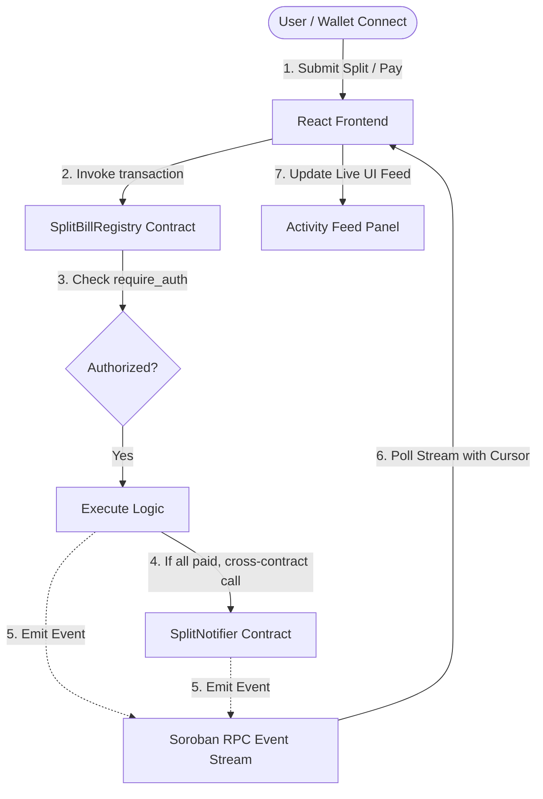
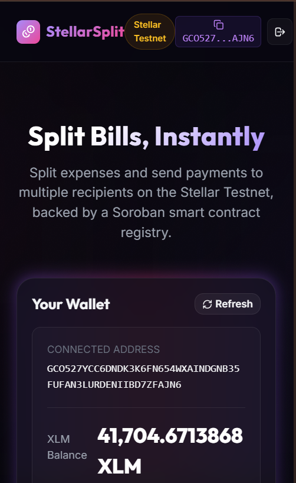
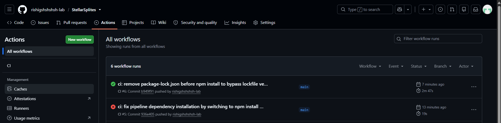
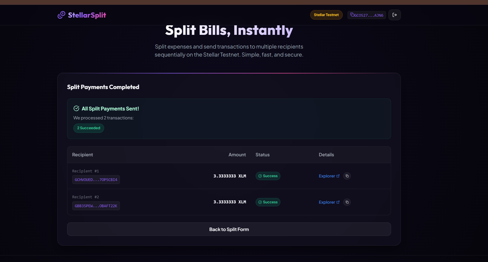

# StellarSplit - Smart Split Bill Calculator (Level 3 - Orange Belt)

[](https://github.com/rishigshshshsh-lab/StellarSplites/actions/workflows/ci.yml)

A beautiful, high-performance decentralized web application (dApp) built on the Stellar Testnet. This upgraded version meets all **Level 3 - Orange Belt** requirements, supporting inter-contract communication, real-time event streaming activity feeds, a CI/CD pipeline, mobile responsive stacked card layouts, and complete automated test coverage (Soroban Rust SDK + Vitest React Testing Library).

---

## 🌟 Level 3 - Orange Belt Upgrades

### 1. Advanced Smart Contract Development
- **Inter-Contract Communication**: The main `SplitBillRegistry` contract executes a cross-contract call to the `SplitNotifier` contract automatically when a bill becomes fully paid.
- **Proper Access Control**: Enforces strict `require_auth` checks on all state-changing functions (`create_split`, `mark_paid`, `cancel_split`, and `add_participant`).
- **Additional Functionality**: Added the `add_participant(env, bill_id, participant)` function to allow dynamically appending participants to unpaid, active splits.

### 2. Event Streaming & Real-Time Updates
- **Soroban RPC Event Streaming**: Connects to the Soroban RPC `getEvents` endpoint with cursor-based pagination to stream events (`split_created`, `payment_marked`, `notify_completed`, `split_cancelled`, and `participant_added`) in real time.
- **Activity Feed UI**: Features a live activity feed panel rendered in the UI, styled with sleek modern badges and explorer links for instant feedback without manual page refreshes.

### 3. CI/CD Pipeline
- **GitHub Actions Integration**: Added a robust workflow (`.github/workflows/ci.yml`) triggering on every push/PR to verify:
  - Frontend lint check (`oxlint`)
  - React application compilation (`npm run build`)
  - Soroban smart contract tests (`cargo test`)

### 4. Smart Contract Deployment Workflow
- **Repeatable Deployment**: Built a repeatable node-based deploy script (`npm run deploy` / `node scripts/deploy.js`) utilizing `stellar-cli` to build, optimize, and deploy both contracts to Testnet, dynamically exporting contract IDs directly to `src/contracts.json`.

### 5. Mobile Responsive Frontend
- **Stacked Card Layout**: The summary table transforms into a stacked card layout on mobile screen widths (375px/414px) using CSS media queries and `data-label` attributes to prevent awkward horizontal scrolls.

### 6. Granular Error Handling & Loading States
- **RPC Network Timeout Error**: Gracefully catches RPC gateway timeouts during ledger submission with dedicated warnings.
- **Simulation Failure Error**: Captures contract call simulation issues (e.g. invalid bill IDs or duplicate entries) and explains them directly to the user.
- **Loading Skeletons**: Displayed in the Activity Feed and Balance components using CSS pulse-glow animations while fetching data.

---

## 📐 Architecture & Inter-Contract Flow



When all participants in a split are marked as paid via `mark_paid`, the `SplitBillRegistry` contract automatically fetches the notifier client and triggers `notify_completed(bill_id, creator)`, checking the creator's authorization on `SplitNotifier`.

---

## 📝 Deployed Contract Addresses (Testnet)

- **Split Bill Registry Contract ID**: `CCDNTBNWZDBCEKMTQABGIZQIO36S2UVOL2RTMQBKCYD5PUOH5FVCUEUQ`
- **Split Notifier Contract ID**: `CB3WRURIEQVYWA77BVBTXFR6MGF7CL2PFQ7SEVI5U72GSJOGUT3H22HL`

---

## 🛠️ Tech Stack

- **Frontend**: React 19, Vite, TypeScript, Vitest, React Testing Library
- **Styling**: Vanilla CSS (Cosmic Dark-mode Design System)
- **Stellar SDKs**: `@stellar/stellar-sdk` & `@creit.tech/stellar-wallets-kit`
- **Contracts**: Rust, Soroban Rust SDK (v25)

---

## 🚀 Setup, Installation & Deployment

### 1. Install Dependencies
```bash
npm install
```

### 2. Run Tests
- **Frontend Vitest Suite**:
  ```bash
  npm test
  ```
- **Rust Contract Suite**:
  ```bash
  cd contract
  cargo test
  ```

### 3. Smart Contract Deployment
To recompile and deploy both contracts:
```bash
npm run deploy
```

### 4. Run Development Server
```bash
npm run dev
```

---

## 🧪 Testing & Coverage

### Smart Contract Rust Tests (Soroban SDK)
The Rust unit test suite covers 6 distinct scenarios in `hello-world/src/test.rs` and 1 in `split-notifier/src/test.rs`:
1. `test_create_split_success`: Validates correct split state initialization.
2. `test_mark_paid_and_notifier_call`: Asserts inter-contract invocation and state transition.
3. `test_unauthorized_create_split`: Verifies rejection of calls lacking proper `require_auth` signatures.
4. `test_cancel_split_success`: Validates dApp cancellations.
5. `test_add_participant_success`: Ensures participant addition succeeds.
6. `test_unauthorized_add_participant`: Enforces that only the bill creator can add participants.
7. `test_notify_completed` (notifier): Asserts state updates.

### Frontend Vitest Tests
Verifies UI stability and react state logic in `src/tests/split.test.tsx`:
- Header Wallet Button disconnected state rendering.
- Header Wallet Button connecting/loader rendering.
- Header Wallet Button connected state showing shortened address.
- SplitForm auto-calculation logic when total bill amount changes.

---

## 🔗 Orange Belt Submission Checklist Requirements

### 1. Live Demo & Video
- **Live Deployed Frontend (Vercel/Netlify)**: [PASTE_YOUR_LIVE_LINK_HERE](#)
- **Demo Walkthrough Video (1-2 mins)**: [PASTE_YOUR_VIDEO_LINK_HERE](#)

### 2. Smart Contract Addresses
- **SplitBillRegistry Contract Address**: `PASTE_REGISTRY_CONTRACT_ADDRESS_HERE`
- **SplitNotifier Contract Address**: `PASTE_NOTIFIER_CONTRACT_ADDRESS_HERE`

### 3. Verifiable Transactions (Stellar.expert)
- **Contract Call Transaction Hash**: [PASTE_TX_HASH_HERE](#)
- **Payment Receipt Hash (Optional)**: [PASTE_TX_HASH_HERE](#)

---

## 📸 Screenshots (Add Yours Below)

1. **Mobile Responsive UI**:
   <!-- PASTE SCREENSHOT HERE -->
   

2. **CI/CD Pipeline Running (Passing)**:
   <!-- PASTE SCREENSHOT HERE -->
   

3. **Test Output (3+ passing tests)**:
   <!-- PASTE SCREENSHOT HERE -->
   

4. **Successful On-Chain Bill Splitting Process Complete**:
   <!-- PASTE SCREENSHOT HERE -->
   

5. **Stellar.expert Contract Call Verification**:
   <!-- PASTE SCREENSHOT HERE -->
   
