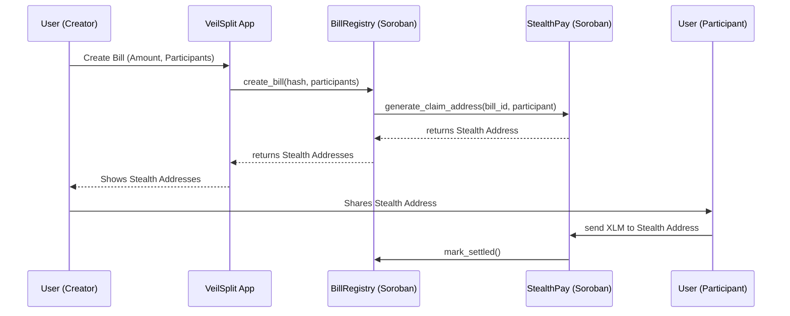

# VeilSplit Architecture

VeilSplit is a privacy-preserving recurring bill settlement protocol built on the Stellar network using Soroban smart contracts. It enables users to split expenses without linking repeated payments on-chain to their main wallets.

## Core Privacy Model

The core of VeilSplit's privacy model relies on two concepts:
1. **Hashed Commitments:** Instead of storing plaintext bill details (like exact amounts and recipient lists) on the public ledger, the registry stores a one-way hash of the commitment.
2. **One-time Stealth Addresses:** To prevent on-chain observers from tracking payment histories between two specific users, the system generates a unique, one-time payment address (stealth address) for each participant per bill.

### Architecture Diagram

## Smart Contracts

### 1. BillRegistry
Manages the lifecycle of a split bill.
- **`create_bill`**: Creates a new bill record, storing only hashed commitments and invoking `StealthPay` to generate claim addresses.
- **`mark_settled`**: Allows the creator or stealth receiver to mark the bill as fully settled.

### 2. StealthPay
Manages the derivation and verification of one-time stealth addresses.
- **`generate_claim_address`**: Uses a deterministic but one-way derivation (e.g., hashing the bill ID with the participant address) to create a unique claim address. In a full production environment, this utilizes Diffie-Hellman key exchange off-chain.
- **`verify_claim`**: Confirms that payment was received at the stealth address and updates the state.

## Frontend Fallback
VeilSplit maintains full backward compatibility with the legacy StellarSplites standard split functionality. Users can toggle between "Standard Split" (direct XLM payments) and "VeilSplit" (stealth mode) in the UI.
